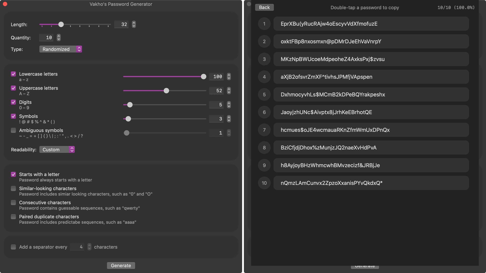
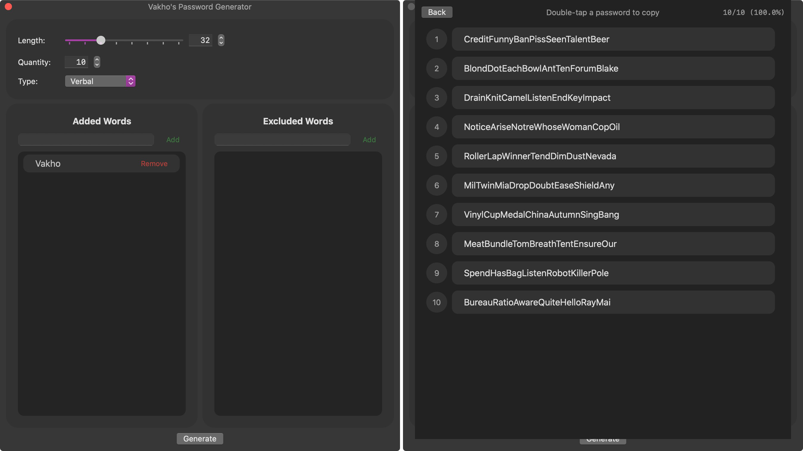

# Vakho's Password Generator

## Table of Contents
- [Description](#description)
- [Technologies](#technologies)
- [Setup](#setup)
- [Examples](#examples)
- [Contact](#contact)

## Description
Vakho's Password Generator is an open-source utility app for macOS. You can use the app to generate randomized or verbal passwords.

#### General Features:
- Vary the length and quantity of passwords generated
- Generate randomized or verbal password

#### Randomized Password:
- Include lowercase letters, uppercase letters, digits, symbols, and ambiguous symbols, and vary their weights. Alternatively, custom readability can be selected with preset wegiths.
- Option to always start with a letter
- Option to omit similar-looking characters, such as "0" and "O"
- Option to omit consecutive characters, such as "qwerty"
- Option to omit paired duplicate characters, such as "aaaa"
- Option to add separator

#### Verbal Password:
- Add your own words to the existing database
- Remove specific words from the existing database

## Technologies
App was developed on macOS 10.15 Catalina in XCode 11. UI was build using SwiftUI, and no external libraries and frameworks were used.

## Setup
You can simply clone the project and build the app from XCode.

## Examples
Randomized password:

Verbal password:

## Contact
e-mail: vakho.kontridze@gmail.com
